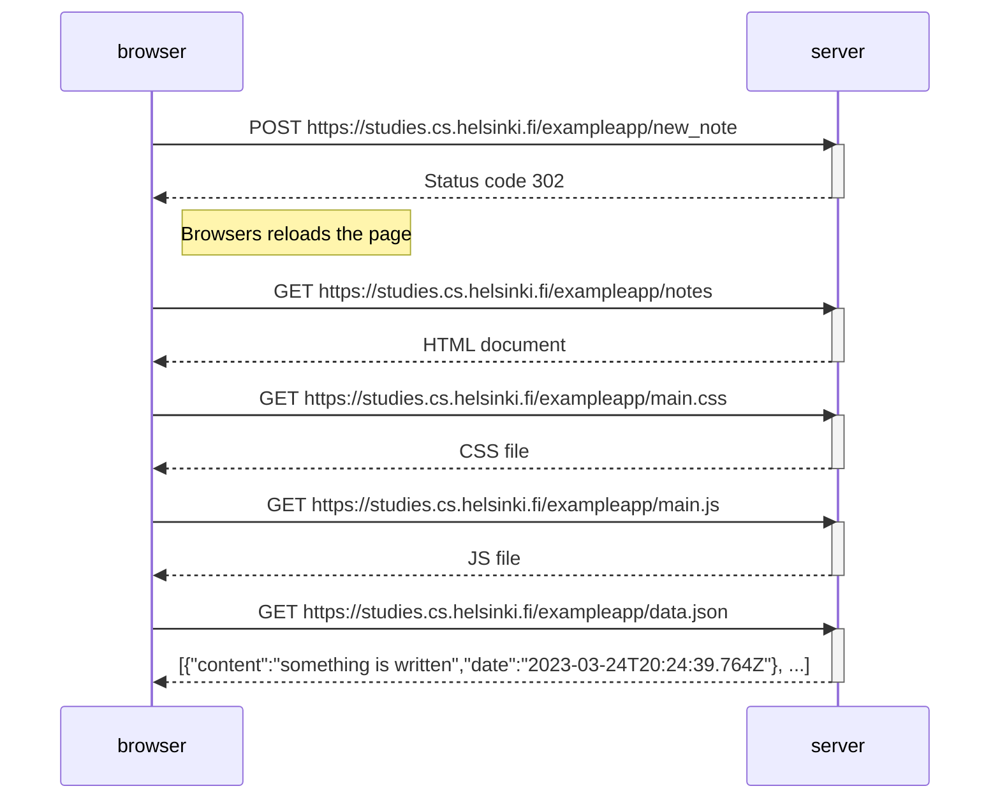

```mermaid
    sequenceDiagram
        participant browser
        participant server

        browser->>server: POST https://studies.cs.helsinki.fi/exampleapp/new_note
        activate server
        server-->>browser: Status code 302
        deactivate server
        note right of browser: Browsers reloads the page

        browser->>server: GET  https://studies.cs.helsinki.fi/exampleapp/notes
        activate server
        server-->>browser: HTML document
        deactivate server

        browser->>server: GET https://studies.cs.helsinki.fi/exampleapp/main.css
        activate server
        server-->>browser: CSS file
        deactivate server

        browser->>server: GET https://studies.cs.helsinki.fi/exampleapp/main.js
        activate server
        server-->>browser: JS file
        deactivate server

        browser->>server: GET  https://studies.cs.helsinki.fi/exampleapp/data.json
        activate server
        server-->>browser: [{"content":"something is written","date":"2023-03-24T20:24:39.764Z"}, ...]
        deactivate server
```
